## 概述与原理

主要开辟缓冲区，依据/var/log/中的日志文件进行文件读取，对于无法直接读取的日志文件，使用指定命令进行日志文件打开提取。使用正则匹配方法、字符串分割方法与字串截取方法进行日志解析。最后将解析的内容汇总转为json字符串切片。

使用os包打开日志文件

使用bufio包创建缓冲区

使用strings包去除特定符号，分割字符串，字串截取

使用os/exec包进行命令执行

使用regexp包进行正则匹配

使用encoding/json包将结构体对象转为json字符串切片


## syslog

**/var/log/syslog**：在某些系统中替代了messages，同样记录系统范围内的各种消息。

### 例：

```bash
Mar 15 13:20:37 k-k1234-pc kernel: [    1.051921][    T1] pci 0000:00:18.2: [15ad:07a0] type 01 class 0x060400
Mar 15 13:20:37 k-k1234-pc CRON[754]: (root) CMD (/usr/bin/timermanager)
Mar 15 13:20:37 k-k1234-pc dbus-daemon[737]: dbus[737]: Unknown username "secadm" in message bus configuration file
Mar 15 13:20:37 k-k1234-pc systemd[1]: Started run kylin_activation_check at boot time.
Mar 15 13:20:37 k-k1234-pc systemd[1]: Starting kylin-daq config...
```

### 函数：

```go
func ParseSyslogMessages() ([]string, error)
//用于解析 syslog 日志文件中的消息并将其转换为 JSON 格式的字符串。
//主要使用正则匹配方法实现，直接读取文件

```

```go
type SyslogMessage struct {
	Type      string `json:"type"`
	Timestamp string `json:"timestamp"`
	Hostname  string `json:"hostname"`
	Appname   string `json:"appname"`
	Message   string `json:"message"`
}
//json字段，其中"type"固定为"syslog_log"

```

### 返回结果：

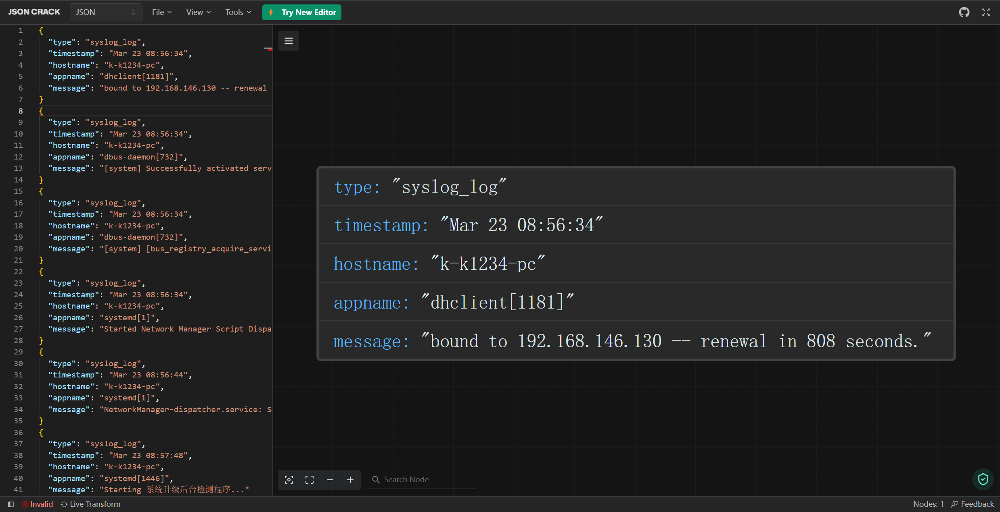


## alternatives.log

**/var/log/alternatives.log** – 更新替代信息都记录在这个文件中。

### 例：

```bash
update-alternatives 2023-04-27 15:39:12: link group gnome-www-browser updated to point to /usr/bin/qaxbrowser-safe-stable
update-alternatives 2023-04-27 15:39:12: run with --install /usr/bin/qaxbrowser-safe qaxbrowser-safe /usr/bin/qaxbrowser-safe-stable 200
update-alternatives 2023-04-27 15:39:12: link group qaxbrowser-safe updated to point to /usr/bin/qaxbrowser-safe-stable
update-alternatives 2024-03-09 09:35:33: run with --install /usr/bin/x-www-browser x-www-browser /usr/bin/qaxbrowser-safe-stable 200
```

### 函数：

```go
func ParseAlternativesLogMessages() ([]string, error)
//用于解析 alternatives.log 日志文件中的消息并将其转换为 JSON 格式的字符串。
//主要使用正则匹配方法实现，直接读取文件

```

```go
type AlternativesLogMessage struct {
	Type      string `json:"type"`
	Timestamp string `json:"timestamp"`
	Message   string `json:"message"`
}
//json字段，其中"type"固定为"alternatives_log"

```

### 返回结果：

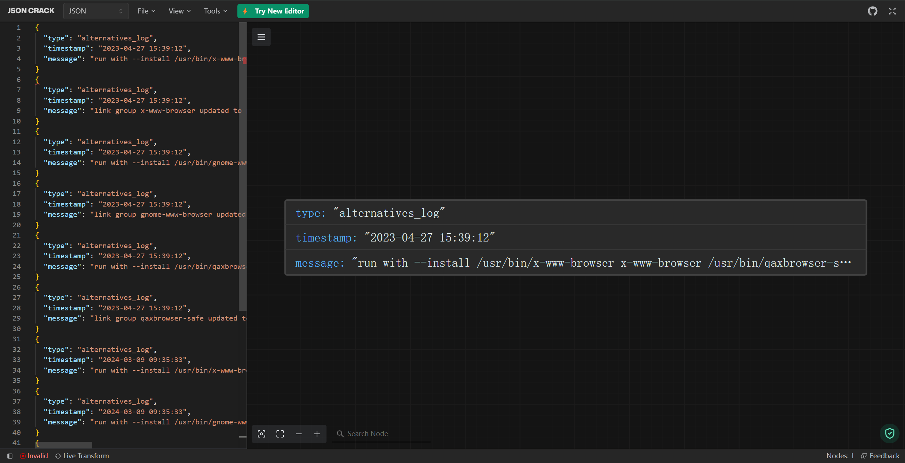

## auth.log

**/var/log/auth.log** — 包含系统授权信息，包括用户登录和使用的权限机制等。

### 例：

```bash
Apr  7 00:08:38 k-k1234-pc su: pam_unix(su:auth): Couldn't open /etc/securetty: 没有那个文件或目录
Apr  7 00:08:38 k-k1234-pc su: FAILED SU (to root) k-k1234 on pts/1
Apr  7 00:10:24 k-k1234-pc polkitd(authority=local): Unregistered Authentication Agent for unix-session:3 (system bus name :1.94, object path /org/ukui/PolicyKit1/AuthenticationAgent, locale zh_CN.UTF-8)
Apr  7 00:10:25 k-k1234-pc systemd-logind[846]: send PrepareForShutdown 1
Apr  7 00:10:26 k-k1234-pc systemd-logind[846]: System is powering down.
Apr  7 00:10:26 k-k1234-pc lightdm: pam_unix(lightdm-autologin:session): session closed for user k-k1234
```

### 函数：

```go
func ParseAuthLogMessages() ([]string, error)
//用于解析 auth.log 日志文件中的消息并将其转换为 JSON 格式的字符串。
//主要使用正则匹配方法实现，直接读取文件

```

```go
type AuthLogMessage struct {
	Type      string `json:"type"`
	Timestamp string `json:"timestamp"`
	Host      string `json:"host"`
	Service   string `json:"service"`
	Message   string `json:"message"`
}
//json字段，其中"type"固定为"auth_log"

```

### 返回结果：

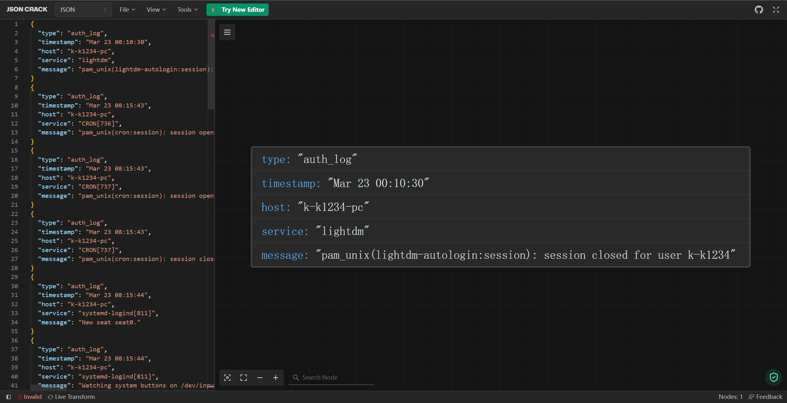

## dpkg.log

**/var/log/dpkg.log** – 包括安装或dpkg命令清除软件包的日志。

### 例：

```bash
2024-03-19 09:13:54 status installed gcc-multilib:amd64 4:9.3.0-11.185.1kylin2k7.5
2024-03-19 09:13:54 trigproc libc-bin:amd64 2.31-0kylin9.2 <无>
2024-03-19 09:13:54 status half-configured libc-bin:amd64 2.31-0kylin9.2
2024-03-19 09:13:54 status installed libc-bin:amd64 2.31-0kylin9.2
```

### 函数：

```go
func ParseDpkgLogMessages() ([]string, error)
//用于解析 dpkg.log 日志文件中的消息并将其转换为 JSON 格式的字符串。
//主要使用分割字符串实现，直接读取文件

```

```go
type DpkgLogMessage struct {
	Type      string `json:"type"`
	Timestamp string `json:"timestamp"`
	ActionPkg string `json:"action_package"`
}
//json字段，其中"type"固定为"dpkg_log"

```

### 返回结果：

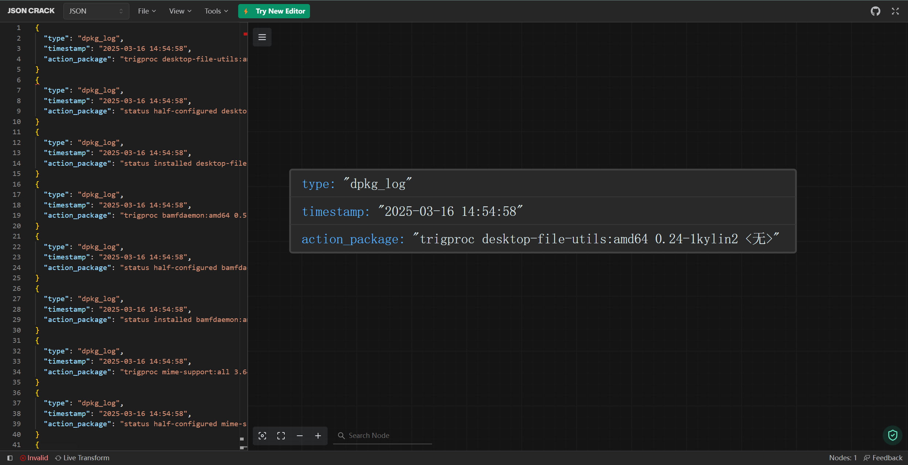

## fontconfig.log

**/var/log/fontconfig.log** -- 用于诊断字体配置问题或了解Fontconfig的行为。（不同系统可能没有此日志）

### 例：

```cobol
/usr/share/fonts/truetype/ubuntu: skipping, looped directory detected
/usr/share/fonts/type1/urw-base35: skipping, looped directory detected
/usr/share/fonts/X11/encodings/large: skipping, looped directory detected
/var/cache/fontconfig: cleaning cache directory
fc-cache: succeeded
```

### 函数：

```go
func ParseFontconfigLogMessages() ([]string, error)
//用于解析 dpkg.log 日志文件中的消息并将其转换为 JSON 格式的字符串。
//主要使用正则匹配方法实现，直接读取文件

```

```go
type FontconfigLogMessage struct {
	Type    string `json:"type"`
	Path    string `json:"path"`
	Message string `json:"message"`
}
//json字段，其中"type"固定为"fontconfig_log"

```

### 返回结果：

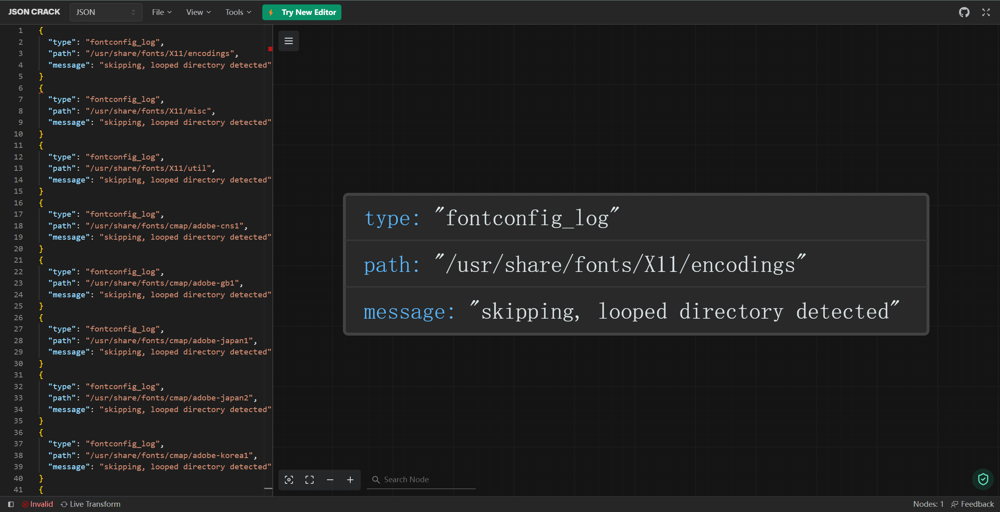

## kern.log

**/var/log/kern.log** – 包含内核产生的日志，有助于在定制内核时解决问题。

### 例：

```bash
Apr  1 18:47:38 k-k1234-pc kernel: [    0.000000][    T0] BIOS-e820: [mem 0x0000000100000000-0x000000013fffffff] usable
Apr  1 18:47:38 k-k1234-pc kernel: [    0.000000][    T0] NX (Execute Disable) protection: active
Apr  1 18:47:38 k-k1234-pc kernel: [    0.000000][    T0] SMBIOS 2.7 present.
Apr  1 18:47:38 k-k1234-pc kernel: [    0.000000][    T0] DMI: VMware, Inc. VMware Virtual Platform/440BX Desktop Reference Platform, BIOS 6.00 11/12/2020
Apr  1 18:47:38 k-k1234-pc kernel: [    0.000000][    T0] vmware: hypercall mode: 0x01
Apr  1 18:47:38 k-k1234-pc kernel: [    0.000000][    T0] Hypervisor detected: VMware
Apr  1 18:47:38 k-k1234-pc kernel: [    0.000000][    T0] vmware: TSC freq read from hypervisor : 3193.884 MHz
```

### 函数：

```go
func ParseKernelLogMessages() ([]string, error)
//用于解析 kern.log 日志文件中的消息并将其转换为 JSON 格式的字符串。
//主要使用正则匹配方法实现，直接读取文件

```

```go
type KernelLogMessage struct {
	Type      string `json:"type"`
	Timestamp string `json:"timestamp"`
	Hostname  string `json:"hostname"`
	Kernel    string `json:"kernel"`
	Message   string `json:"message"`
}
//json字段，其中"type"固定为"kernel_log"

```

### 返回结果：

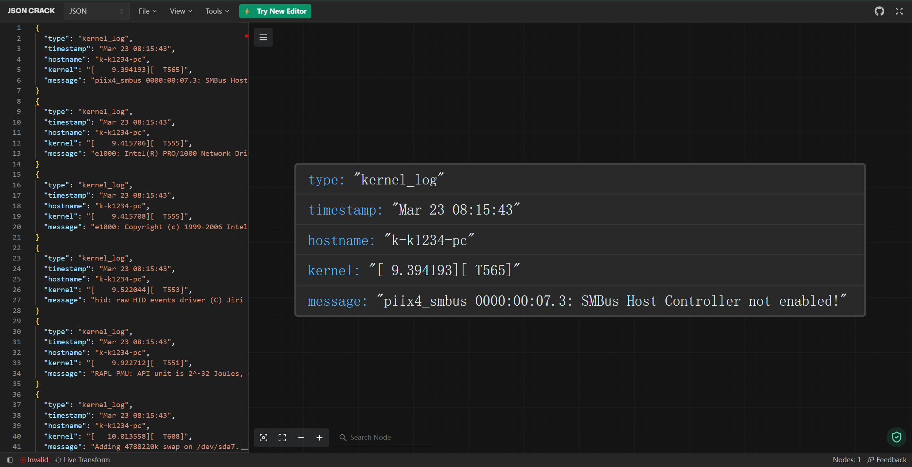

## Xorg.0.log

**Xorg.0.log** 是 Linux 系统中与 X 服务器相关的日志文件。它主要记录了 Xfree86 Xwindows 服务器最后一次执行的结果。如果在启动到图形模式时遇到了问题，通常可以从这个文件中找到失败的原因。

Xorg.0.log.old为旧数据

### 例：

```bash
[    14.417] 
X.Org X Server 1.20.9
X Protocol Version 11, Revision 0
[    14.417] Build Operating System: Linux 4.4.0-62-generic x86_64 Ubuntu
[    14.417] Current Operating System: Linux k-k1234-pc 5.10.0-8-generic #33~v10pro-KYLINOS SMP Wed Mar 22 07:21:49 UTC 2023 x86_64
[    14.417] Markers: (--) probed, (**) from config file, (==) default setting,
	(++) from command line, (!!) notice, (II) informational,
	(WW) warning, (EE) error, (NI) not implemented, (??) unknown.
[    14.418] (==) Log file: "/var/log/Xorg.0.log", Time: Sat Apr 13 14:24:17 2024
[    14.421] (==) Using system config directory "/usr/share/X11/xorg.conf.d"
[    14.432] (==) No Layout section.  Using the first Screen section.
[    14.432] (==) No screen section available. Using defaults.
[    14.432] (**) |-->Screen "Default Screen Section" (0)
```

### 函数：

```go
func ParseXorgLogMessages() ([]string, error)
//用于解析 kern.log 日志文件中的消息并将其转换为 JSON 格式的字符串。
//主要使用正则匹配方法实现，直接读取文件

```

```go
type XorgLogMessage struct {
	Type      string `json:"type"`
	Timestamp string `json:"timestamp"`
	Message   string `json:"message"`
}
//json字段，其中"type"固定为"xorg_log"

```

### 返回结果：

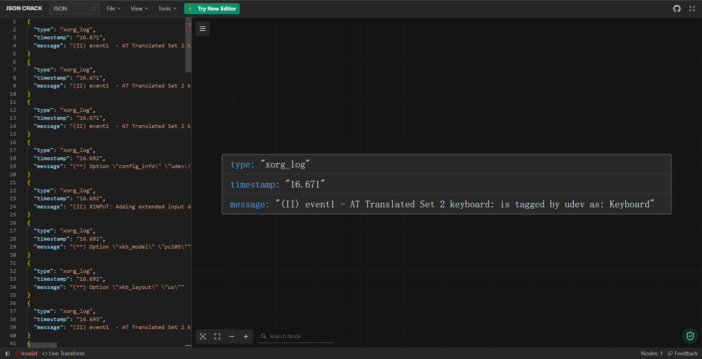

## dmesg

/**var/log/dmesg** — 包含内核缓冲信息（kernel ring buffer）。在系统启动时，会在屏幕上显示许多与硬件有关的信息。可以用dmesg(可以显示更全)查看它们。

dmesg.0为过去信息

dmesg.1.gz为更久远的信息，还有dmesg.2.gz等等

### 例：

```bash
[    0.000000] kernel: BIOS-e820: [mem 0x00000000fffe0000-0x00000000ffffffff] reserved
[    0.000000] kernel: BIOS-e820: [mem 0x0000000100000000-0x000000013fffffff] usable
[    0.000000] kernel: NX (Execute Disable) protection: active
[    0.000000] kernel: SMBIOS 2.7 present.
[    0.000000] kernel: DMI: VMware, Inc. VMware Virtual Platform/440BX Desktop Reference Platform, BIOS 6.00 11/12/2020
[    0.000000] kernel: vmware: hypercall mode: 0x01
[    0.000000] kernel: Hypervisor detected: VMware
[    0.000000] kernel: vmware: TSC freq read from hypervisor : 3193.885 MHz
[    0.000000] kernel: vmware: Host bus clock speed read from hypervisor : 66000000 Hz
[    0.000000] kernel: vmware: using clock offset of 37219601091 ns
[    0.000020] kernel: tsc: Detected 3193.885 MHz processor
[    0.001648] kernel: e820: update [mem 0x00000000-0x00000fff] usable ==> reserved
[    0.001652] kernel: e820: remove [mem 0x000a0000-0x000fffff] usable
[    0.001659] kernel: last_pfn = 0x140000 max_arch_pfn = 0x400000000
```

### 函数：

```go
func ParseDmesgLogMessages() ([]string, error)
//用于解析 dmesg 日志文件中的消息并将其转换为 JSON 格式的字符串。
//主要使用正则匹配方法实现，命令执行读取文件

```

```go
type DmesgLogMessage struct {
	Type      string `json:"type"`
	Timestamp string `json:"timestamp"`
	Kernel    string `json:"kernel"`
	Message   string `json:"message"`
}
//json字段，其中"type"固定为"dmesg_log"

```

### 返回结果：

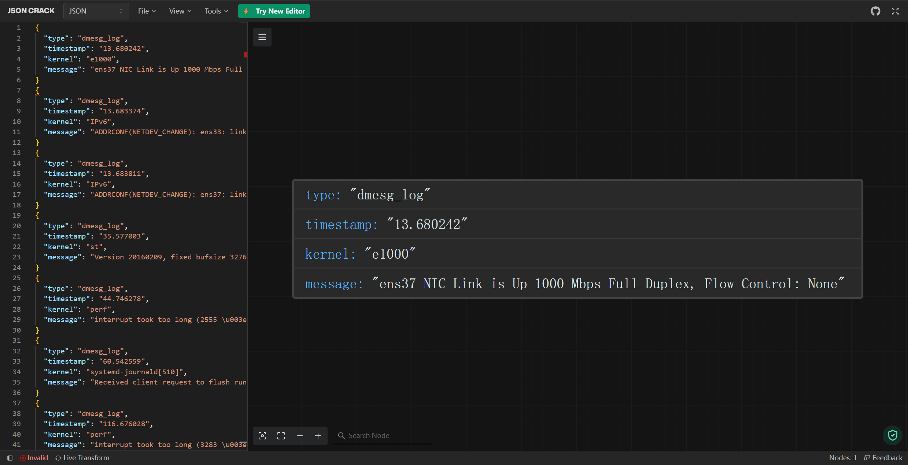

## faillog

**/var/log/faillog** – 包含用户登录失败信息。此外，错误登录命令也会记录在本文件中。命令：faillog -a

### 例：

```bash
登录        失败次数  最多   最近                     于

root            0        0   01/01/70 08:00:00 +0800  
daemon          0        0   01/01/70 08:00:00 +0800  
bin             0        0   01/01/70 08:00:00 +0800  
sys             0        0   01/01/70 08:00:00 +0800
apt-p2p         0        0   01/01/70 08:00:00 +0800  
uuidd           0        0   01/01/70 08:00:00 +0800  
k-k1234         0        0   01/01/70 08:00:00 +0800
```

### 函数：

```go
func ParseFaillogEntries() ([]string, error) 
//用于解析 faillog 日志文件中的消息并将其转换为 JSON 格式的字符串。
//主要使用分割字符串方法实现，命令执行读取文件

```

```go
type FaillogEntry struct {
	Type         string `json:"type"`
	Username     string `json:"username"`
	Failures     string `json:"failures"`
	MaxFailures  string `json:"max_failures"`
	LastLogin    string `json:"last_login"`
	LastLoginUTC string `json:"last_login_utc"`
}
//json字段，其中"type"固定为"faillog_log"

```

### 返回结果：

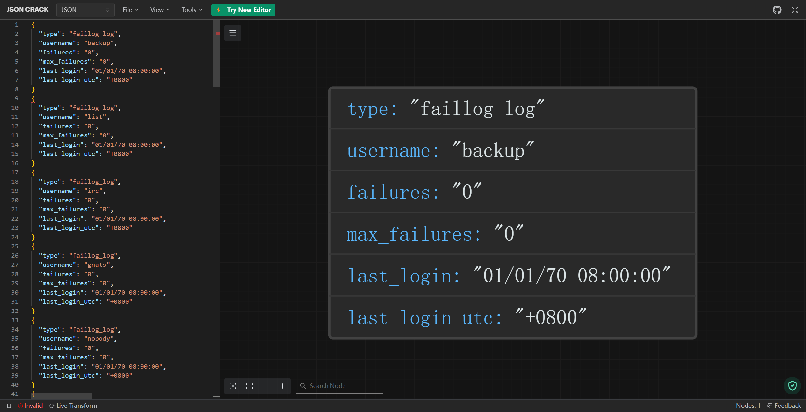

## lastlog

**/var/log/lastlog** — 记录所有用户的最近信息。这不是一个ASCII文件，因此需要用lastlog命令查看内容。

### 例：

```cobol
用户名           端口     来自             最后登录时间
root                                       **从未登录过**
daemon                                     **从未登录过**
bin                                        **从未登录过**
sys                                        **从未登录过**
sync                                       **从未登录过**
```

### 函数：

```go
func ParseLastlogLogMessages() ([]string, error) 
//用于解析 lastlog 日志文件中的消息并将其转换为 JSON 格式的字符串。
//主要使用正则匹配方法实现，命令执行读取文件

```

```go
type LastlogLogMessage struct {
	Type      string `json:"type"`
	Username  string `json:"username"`
	Port      string `json:"port"`
	From      string `json:"from"`
	LastLogin string `json:"last_login"`
}
//json字段，其中"type"固定为"lastlog_log"

```

### 返回结果：

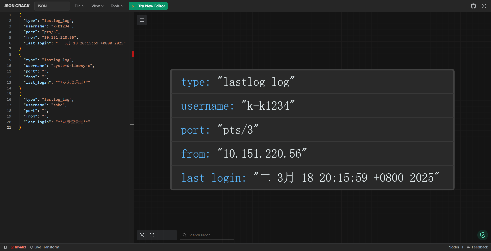

## wtmp

**/var/log/wtmp或/var/log/utmp** — 包含登录信息。使用wtmp可以找出谁正在登陆进入系统，谁使用命令显示这个文件或信息等。命令：last -f wtmp

### 例：

```bash
k-k1234  tty7         :0               Sat Apr 13 14:24   still logged in
reboot   system boot  5.10.0-8-generic Sat Apr 13 22:24   still running
k-k1234  tty7         :0               Sun Mar  3 10:16 - 10:39  (00:22)
reboot   system boot  5.10.0-8-generic Sun Mar  3 18:16 - 10:39  (-7:37)
k-k1234  tty7         :0               Wed Feb 14 21:48 - 21:57  (00:08)
reboot   system boot  5.10.0-8-generic Thu Feb 15 05:48 - 21:57  (-7:50)

wtmp begins Thu Feb 15 05:48:02 2024
```

命令last --time-format iso

```sh
k-k1234  tty7         :0               2024-05-04T21:11:41+08:00   gone - no logout
reboot   system boot  5.10.0-8-generic 2024-05-05T05:11:26+08:00   still running
k-k1234  tty7         :0               2024-04-30T18:38:24+08:00 - 2024-04-30T21:27:23+08:00  (02:48)
```

### 函数：

```go
func ParseWtmpLogMessages() ([]string, error)
//用于解析 wtmp 日志文件中的消息并将其转换为 JSON 格式的字符串。
//主要使用截取字串方法实现，命令执行读取文件

```

```go
type WtmpLogMessage struct {
	Type       string `json:"type"`
	User       string `json:"user"`
	Terminal   string `json:"terminal"`
	SystemInfo string `json:"system_info"`
	StartTime  string `json:"start_time"`
	EndTime    string `json:"end_time"`
	Duration   string `json:"duration"`
}
//json字段，其中"type"固定为"wtmp_log"

```

### 返回结果：

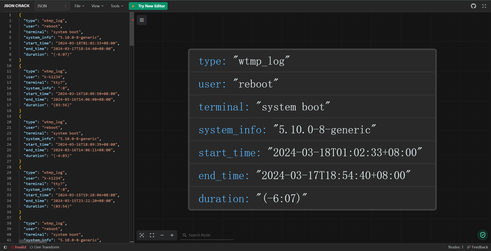


## 基本读取函数原理（无需使用）

### 直接打开文件读取

```go
func readLogMessages(logPath string) ([]string, error)
//接收log文件路径，返回log文件内容的字符串切片！！！！！！！！
```

### 命令打开日志读取

```go
func cmdLogFile(cmdString string, arg ...string) ([]string, error)
//接收命令与任意数量参数，返回命令执行返回的字符串切片！！！！！！！！
```


